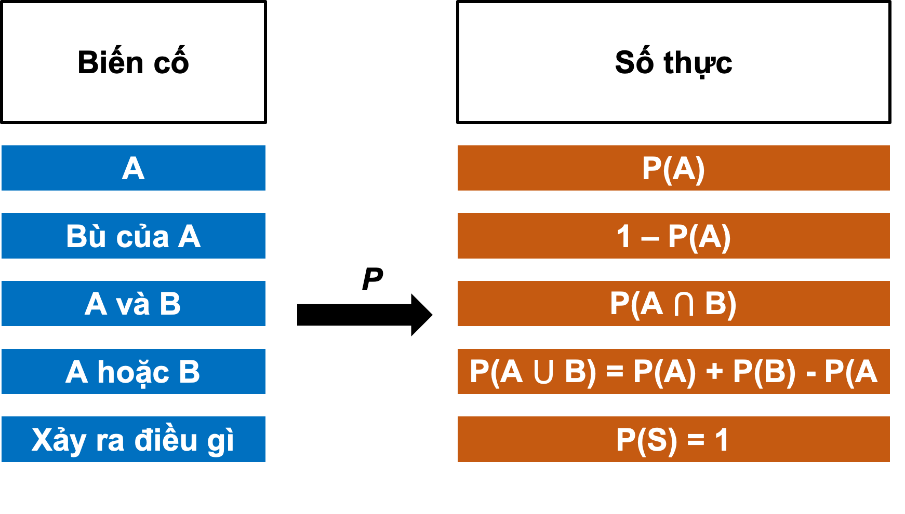
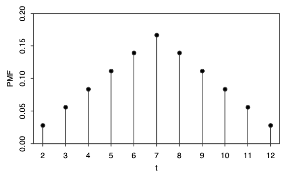
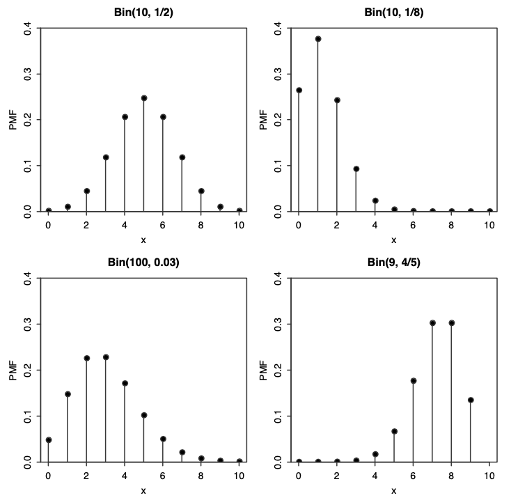

# Kiến thức cơ bản về xác suất {#prob}

## Các khái niệm cơ bản

Các tính toán về xác suất bắt đầu với các **thử nghiệm (experiment)**. Mỗi thử nghiệm là một hoặc một chuỗi các hành động đưa đến kết quả. Các thử nghiệm này có thể được lặp đi lặp lại nhiều lần. Kết quả từ các thử nghiệm sẽ giúp tính toán các xác suất tương ứng.

Kết quả của một thử nghiệm được gọi là **kết cục (outcome)**. Một thử nghiệm có thể có nhiều kết cục khác nhau. Tuy nhiên, trong mỗi một lần thử nghiệm, chúng ta chỉ có thể quan sát được duy nhất một kết cục.

Tập hợp của tất cả các kết cục có thể có của một thử nghiệm được gọi là **không gian mẫu (sample space)**. 

**Biến cố (event)** là một sự kiện bao gồm một hoặc một vài kết cuộc trong không gian mẫu. Do đó biến cố là một tập hợp con của không gian mẫu. Một biến cố được xem là xảy ra (occurred) nếu kết cục thực tế quan sát thấy có chứa trong biến cố đó.

### Ví dụ 1: Tung một đồng xu một lần (flip a coin one time) 

Ở đây, thử nghiệm là tung đồng xu một lần. 

Các kết cục có thể có của thử nghiệm này là được mặt sấp ($S$) hoặc mặt ngửa ($N$). 

Do đó, không gian mẫu sẽ là một tập hợp với 2 phần tử: $S = \{\text{S},\text{N} \}$. 

Trên không gian mẫu này có thể định nghĩa nhiều biến cố khác nhau:

* Biến cố được mặt ngửa: $A = \{\text{N}\}$
* Biến cố được mặt sấp: $B = \{\text{S}\}$

Nếu thực hiện thử nghiệm và kết quả được mặt sấp, như vậy biến cố $A$ đã xảy ra.

```{r example1, fig.cap="Minh hoạ cho ví dụ 1", echo=FALSE}

```

### Ví dụ 2: Tung một đồng xu hai lần 

Ở đây, thử nghiệm là tung đồng xu hai lần. 

Các kết cục có thể có của thử nghiệm này là được 2 mặt sấp ($SS$), hoặc 2 mặt ngửa ($NN$), hoặc ngửa rồi sấp ($NS$), hoặc sấp rồi ngửa ($SN$). 

Do đó, không gian mẫu sẽ là một tập hợp với 4 phần tử: $S = \{\text{SS},\text{NN},\text{NS},\text{SN}\}$. 

Trên không gian mẫu này có thể định nghĩa nhiều biến cố khác nhau, ví dụ như:

* Biến cố được mặt ngửa đầu tiên: $A = \{\text{NN},\text{NS}\}$
* Biến cố được mặt thứ hai là mặt ngửa: $B = \{\text{NN},\text{SN}\}$

Nếu thực hiện thử nghiệm và kết quả được 2 mặt ngửa, như vậy cả biến cố $A$ và biến cố $B$ đều đã xảy ra.

```{r example2, fig.cap="Minh hoạ cho ví dụ 2", echo=FALSE}
knitr::include_graphics("figures/Picture02.png")
```

### Ví dụ 3: viêm tĩnh mạch (phlebitis) sau khi sử dụng đường truyền tĩnh mạch ngoại biên (peripheral intravenous catheter)

Ở đây, thử nghiệm là sử dụng đường truyền tĩnh mạch ngoại biên. 

Các kết cục có thể có của thử nghiệm này là bị viêm tĩnh mạch ($\text{VTM+}$) hoặc không bị viêm tĩnh mạch ($\text{VTM-}$). 

Do đó, không gian mẫu sẽ là một tập hợp với 2 thành phần: $S = \{\text{VTM+},\text{VTM-}\}$. 

Trên không gian mẫu này có thể định nghĩa biến cố $A$ là biến cố xảy ra viêm tĩnh mạch: $A = \{VTM+\}$

Nếu một bệnh nhân được sử dụng đường truyền tĩnh mạch và sau đó bị viêm tĩnh mạch thì ta nói rằng biến cố $A$ đã xảy ra.

### Lý thuyết về tập hợp (sets)

Với $A$ và $B$ là 2 biến cố được định nghĩa trên cùng không gian mẫu $S$

* Hợp (union) của $A$ và $B$ ($A \cup B$) là một biến cố xảy ra khi và chỉ khi $A$ hay $B$ xảy ra.
* Giao (intersection) của $A$ và $B$ ($A \cap B$) là một biến cố xảy ra khi và chỉ khi $A$ và $B$ xảy ra.
* Phần bù (complement) của $A$ ($A^c$) là một biến cố xảy ra khi và chỉ khi $A$ không xảy ra.

Quay trở lại ví dụ 2:

* Gọi $C$ là biến cố có ít nhất 1 mặt ngửa:    $C = A \cup B = \{\text{NN},\text{NS},\text{SN}\}$
* Gọi $D$ là biến cố cả 2 mặt đều là mặt ngửa: $D = A \cap B = \{\text{NN}\}$
* Gọi $E$ là biến cố có mặt sấp đầu tiên:      $E = A^c      = \{\text{SN},\text{SS}\}$

```{r example3, fig.cap="Minh hoạ cho lý thuyết tập hợp", echo=FALSE}

```

## Định nghĩa xác suất (probability)

### Định nghĩa đơn giản về xác suất (naive definition of probability)

Gọi $A$ là một biến cố trong một thử nghiệm với không gian mẫu $S$. 

Xác suất xảy ra của $A$ (định nghĩa đơn giản) là: 

$$
P(A) = \frac{\text{Size of A}}{\text{Size of S}} = \frac{\text{Số lượng kết cục của A}}{\text{Tổng số kết cục trong S}}
$$

Trong ví dụ 2:

* $P(A) = \frac{2}{4} = 0.5$
* $P(B) = \frac{2}{4} = 0.5$
* $P(C) = \frac{3}{4} = 0.75$
* $P(D) = \frac{1}{4} = 0.25$
* $P(E) = \frac{2}{4} = 0.5$

### Tính xác suất theo quy tắc nhân (multiplication rule)

Để tính xác suất (theo định nghĩa đơn giản) của biến cố $A$, chúng ta cần đếm được số phần tử của $A$ và số phần tử của $B$. Trong nhiều trường hợp, những số lượng này rất lớn và do đó, không thể đếm trực tiếp theo cách thông thường được. Một cách đếm nhanh hơn là sử dụng **quy tắc nhân (multiplication rule)**:

>Thực hiện một thử nghiệm phức tạp, kết hợp hai thử nghiệm $A$ và $B$. Giả sử thử nghiệm $A$ có thể có $a$ kết cục; và ứng với mỗi kết cục của $A$, thử nghiệm $B$ có $b$ kết cục. Khi đó thử nghiệm phức tạp kết hợp $A$ và $B$ có thể có $a \times b$ kết cục.

#### Ví dụ 4: Chạy thi

>Có 10 người tham gia một cuộc thi chạy. Giả định rằng không có trường hợp đồng hạng và cả 10 người đều hoàn thành đường đua của mình. Khi đó luôn xác định được người xếp hạng nhất, nhì, ba. Có tất cả bao nhiêu cách chọn ra được người xếp hạng nhất, nhì, ba?

Có tất cả 10 cách chọn người xếp hạng nhất. 

Sau khi chọn được người xếp hạng nhất, có 9 cách chọn người xếp hạng nhì. 

Sau khi đã chọn được người xếp hạng nhất và hạng nhì, có 8 cách chọn người xếp hạng ba. 

Như vậy có tất cả $10 \times 9 \times 8 = 720$ cách chọn ra được người xếp hạng nhất, nhì, ba. 

#### Định lý về chọn mẫu lặp lại (sampling with replacement)

>Có $n$ đối tượng và cần lần lượt chọn ra $k$ phần tử từ các đối tượng này, theo kiểu **lặp lại** (một đối tượng đã được chọn vẫn có thể tiếp tục được chọn trong lần chọn tiếp theo). Khi đó sẽ có tất cả $n^k$ cách chọn (có tính đến thứ tự).

#### Định lý về chọn mẫu không lặp lại (sampling without replacement)

>Có $n$ đối tượng và cần lần lượt chọn ra $k$ phần tử từ các đối tượng này, theo kiểu **không lặp lại** (một đối tượng đã được chọn thì không thể được chọn trong lần chọn tiếp theo). Khi đó sẽ có tất cả $n \times (n-1) \ldots (n-k+1)$ cách chọn (có tính đến thứ tự), với $k \leq n$. Khi $k=n$, số cách chọn là $n \times (n-1) \ldots 1 = n!$

### Ví dụ 5: the last banana

> Minh và Lan bị lạc trên hoang đảo. Đến ngày hôm nay thức ăn chỉ còn lại một quả chuối. Để phân định ai sẽ được ăn quả chuối, Minh và Lan quyết định cầu may bằng việc tung xúc sắc. Sau khi mỗi người tung xúc sắc của mình, điểm xúc sắc của hai người sẽ được so với nhau để xác định điểm cao nhất. Nếu điểm cao nhất là từ 1 đến 4 thì Minh thắng và được ăn quả chuối; nhưng nếu điểm cao nhất là 5 hay 6 thì Lan sẽ thắng. Hãy xác định xem giữa Minh và Lan thì ai có xác suất thắng cao hơn?

Trong ví dụ này thử nghiệm là tung hai xúc sắc. 

Khi tung một xúc sắc có thể có 6 kết cục khác nhau. Theo quy tắc nhân, khi tung hai xúc sắc sẽ có tất cả $6 \times 6 = 36$ kết cục khác nhau.

Gọi $A$ là biến cố điểm cao nhất trong một lần tung 2 xúc sắc là từ 1 đến 4.

Gọi $B$ là biến cố điểm cao nhất trong một lần tung 2 xúc sắc là từ 5 đến 6.

Không gian mẫu, điểm cao nhất trong từng kết cục và khả năng xuất hiện của biến cố $A$ và $B$ trong không gian mẫu được trình bày ở hình sau:

```{r example5, fig.cap="Minh hoạ cho ví dụ 5", echo=FALSE}
knitr::include_graphics("figures/Picture04.png")
```

Như vậy xác suất $A$ xảy ra là $P(A) = \frac{16}{36} = 0.44$, còn xác suất $B$ xảy ra là $P(B) = \frac{20}{36} = 0.56$

Như vậy Lan có xác suất thắng cao hơn.

Link Youtube cho ví dụ này: https://youtu.be/Kgudt4PXs28


### Hạn chế của định nghĩa đơn giản về xác suất

Định nghĩa đơn giản trên về xác suất có hai hạn chế chính:

* Không gian mẫu $S$ phải hữu hạn (finite sample space)
* Các kết cục có khả năng xảy ra như nhau (equally likely outcome)

### Định nghĩa đầy đủ về xác suất

Một không gian xác suất (probability space) bao gồm một không gian mẫu $S$ và một hàm số xác suất $P$, trong đó hàm số xác suất $P$ sẽ gán một số thực từ 0 đến 1 cho từng biến cố $A$ trong $S$. Hàm số $P$ phải thoả mãn các tiên đề sau:

* $P(\emptyset) = 0$ (xác suất của tập hợp rỗng bằng 0)
* $P(S) = 1$ (xác suất của không gian mẫu bằng 1)
* Nếu $A_1,A_2,\dots$ là các biến cố xung khắc (mutually exclusive or disjoint), thì: $P(\bigcup\limits_{j=1}^{\infty} A_{j}) = \Sigma_{j=1}^{\infty}P(A_{j})$

#### Các tính chất của xác suất

Với các biến cố $A$ và $B$ bất kỳ:

* $P(A^c) = 1 - P(A)$
* Nếu $A$ là tập hợp con của $B$ ($A \subseteq$ B) thì $P(A) \leq P(B)$
* $P(A \cup B) = P(A) + P(B) - P(A \cap B)$

Định nghĩa và tính chất của xác suất được tóm tắt trong hình sau:

```{r generaldefinition, fig.cap="Định nghĩa và tính chất của xác suất", echo=FALSE}

```

### Diễn giải ý nghĩa của xác suất

#### Theo trường phái frequentist

Xác suất của một biến cố thể hiện tần số xuất hiện của biến cố đó khi lặp lại thử nghiệm nhiều lần. Ví dụ, xác suất được mặt ngửa khi tung một đồng xu bằng 50%, nghĩa là nếu tung đồng xu rất nhiều lần, mặt ngửa sẽ xuất hiện trong khoảng 50% số lần tung đó.

#### Theo trường phái Bayesian

Xác suất của một biến cố phản ánh mức độ tin tưởng vào sự xuất hiện của biến cố đó, kể cả khi không thể lặp lại thử nghiệm.

## Xác suất có điều kiện

### Định nghĩa xác suất có điều kiện

Nếu $A$ và $B$ là các biến cố với $P(B) > 0$, xác suất của $A$ khi biết $B$ ($P(A | B)$) được tính bằng công thức

$$
P(A|B) = \frac{P(A \cap B)}{P(B)}
$$
#### Định lí về xác suất phần giao của hai biến cố

Với các biến cố $A$ và $B$ có xác suất $>0$ bất kỳ:

$$
P(A \cap B) = P(B) \times P(A|B) = P(A) \times P(B|A)
$$

### Định lí Bayes (Bayes' rule)

Với các biến cố $A$ và $B$ bất kỳ và $P(B) > 0$:

$$
P(A|B) = \frac{P(B|A)P(A)}{P(B)}
$$
$P(A)$ được gọi là **xác suất tiền nghiệm (prior probability)** của $A$, và $P(A|B)$ được gọi là xác suất hậu nghiệm (posterior probability) của $A$ sau khi biết $B$ đã xảy ra.

### Luật xác suất toàn phần (law of total probability)

Gọi $A_1,\ldots,A_n$ là các phần của không gian mẫu $S$ (nghĩa là $A_1,\ldots,A_n$ xung khắc với nhau, và hợp của chúng là $S$) và xác suất của các phần này đều $>0$ ($P(A_i) > 0$ với mọi $i$)

$$
P(B) = \Sigma^n_{i = 1}P(B|A_i)P(A_i)
$$

Nói cách khác, để tính xác suất không điều kiện của $B$, cần chia không gian mẫu $S$ thành các phần không trùng lắp $A_i$, sau đó tính xác suất có điều kiện của $B$ trong từng phần, cuối cùng lấy tổng các tích số của xác suất có điều kiện đó với xác suất của từng phần.

### Sự độc lập của các biến cố (Independence of events)

Hai biến cố $A$ và $B$ độc lập với nhau nếu

$$
P(A \cap B) = P(A) \times P(B)
$$
nói cách khác

$$
P(A|B) = P(A)
$$

Lưu ý, **độc lập (independence)** khác với **xung khắc (mutually exclusive/disjoint)**. Khi $A$ và $B$ xung khắc với nhau, chúng không độc lập với nhau, trừ khi $P(A) = 0$ hay $P(B) = 0$ (vì khi biết $A$ xảy ra sẽ dễ dàng suy ra $B$ không xảy ra).

## Biến số ngẫu nhiên (Random variables)

> Cho một thử nghiệm với không gian mẫu $S$, một **biến số ngẫu nhiên** là một hàm số kết nối từ không gian mẫu $S$ sang tập hợp số thực $R$

Nói cách khác, biến số ngẫu nhiên $X$ gán một giá trị $X(s)$ cho mỗi kết cục $s$ của thử nghiệm.

### Ví dụ:

Quay trở lại với thử nghiệm tung 2 đồng xu. 

Không gian mẫu bao gồm 4 kết cục: $S = \{SS, NN, SN, NS\}$

Dưới đây là một số biến số ngẫu nhiên có thể được định nghĩa trên không gian mẫu này:

* $X$ là số mặt ngửa. Đây là một biến số ngẫu nhiên với 3 giá trị có thể có: 0, 1, 2. Biến số này gán 2 cho kết cục $NN$ ($X(NN) = 2$), 1 cho kết cục $NS$ hay $SN$ ($X(NS) = X(SN) = 1$) và 0 cho kết cục $SS$ ($X(SS) = 0$)

* $Y$ là số mặt sấp. Có thể định nghĩa biến số ngẫu nhiên này bằng: $Y(s) = 2 - X(s)$

* $I = 1$ nếu được mặt ngửa đầu tiên và $I = 0$ trong những trường hợp khác.  Đây là một biến số ngẫu nhiên với 2 giá trị: 0, 1. Biến số này gán 1 cho kết cục $NN$ hay $NS$ ($I(NN) = I(NS) = 1$), và gán 0 cho kết cục $SN$ hay $SS$ ($I(SN) = I(SS) = 0$) 

```{r, fig.cap="Minh hoạ cho biến số ngẫu nhiên", echo=FALSE}

```

### Loại biến số ngẫu nhiên

Có hai loại biến số ngẫu nhiên: **biến số ngẫu nhiên rời rạc (discrete random variables)** và **biến số ngẫu nhiên liên tục (continuous random variables)**.

#### Biến số ngẫu nhiên rời rạc (discrete random variables)

> Một biến số ngẫu nhiên X được xem là rời rạc nếu tập hợp các giá trị có thể có của X là một tập hợp hữu hạn hoặc vô hạn nhưng đếm được.

> Một biến số ngẫu nhiên X được xem là liên tục nếu X có thể có bất kỳ giá trị nào trong một khoảng trên trục số

## Phân phối xác suất (Probability distribution)

Phân phối của một biến số ngẫu nhiên mô tả xác suất của mọi biến cố liên quan đến biến số ngẫu nhiên.

### Phân phối của biến số ngẫu nhiên rời rạc

#### Hàm khối xác suất (Probability mass function, PMF)

The probability mass function (PMF) of a discrete r.v. X is the function $p_X$ given by $p_X(x) = P(X = x)$. Note that this is positive if x is in the support of X, and 0 otherwise.

#### Tính chất của PMF

Cho $X$ là biến số ngẫu nhiên rời rạc với các giá trị có thể có là $x_1, x_2, \ldots$. PMF $p_X$ của $X$ phải thoả mãn hai tiêu chí sau:

* Không âm: $p_X(x) > 0$ cho một vài giá trị $x$ và $p_X(x) = 0$ cho các giá trị còn lại
* Tổng bằng 1: $\Sigma^\infty_{j = 1}p_X(x_j) = 1$

#### Ví dụ

Tìm hàm khối xác suất của các biến số ngẫu nhiên sau trong thử nghiệm tung 2 đồng xu:

* $X$ là số mặt ngửa
    + $p_X(0) = P(X = 0) = 1/4$
    + $p_X(1) = P(X = 1) = 1/2$
    + $p_X(2) = P(X = 2) = 1/4$
    + $p_X(x) = 0$ cho mọi giá trị khác của $x$
* $Y$ là số mặt sấp
    + $p_Y(0) = P(Y = 0) = 1/4$
    + $p_Y(1) = P(Y = 1) = 1/2$
    + $p_Y(2) = P(Y = 2) = 1/4$
    + $p_Y(y) = 0$ cho mọi giá trị khác của $y$
* $I = 1$ nếu được mặt ngửa đầu tiên và $I = 0$ trong những trường hợp khác
    + $p_I(0) = P(I = 0) = 1/2$
    + $p_I(1) = P(I = 1) = 1/2$
    + $p_I(i) = 0$ cho mọi giá trị khác của $i$

Các hàm khối xác suất này được minh hoạ trong hình sau:

```{r, fig.cap="Minh hoạ cho hàm khối xác suất", echo=FALSE}
knitr::include_graphics("figures/Picture07.png")
```

#### Ví dụ:

Tung 2 xúc sắc $A$ và $B$. Xác định PMF của các biến số ngẫu nhiên sau:

* $X$ là điểm số của xúc sắc $A$.
* $Y$ là điểm số của xúc sắc $B$
* $Z = 7 - X$
* $T = X + Y$

PMF của $T$ được minh hoạ trong hình sau:

```{r, fig.cap="Minh hoạ cho PMF của $T$", echo=FALSE}

```

#### Ví dụ:

Với ví dụ trên, tính xác suất tổng điểm của 2 xúc sắc ($T$) có giá trị từ 1 đến 4

$P(1 \leq T \leq 4) = P(T = 2) + P(T = 3) + P(T = 4) = 6/36$

#### Phân phối Bernoulli (Bernoulli distribution)

Một biến số ngẫu nhiên $X$ có phân phối Bernoulli với tham số $p$ nếu $P(X = 1) = p$ và $P(X = 0) = 1 - p$, với $0 < p < 1$. Ta có thể ký hiệu là $X \sim Bern(p)$

Mọi biến số ngẫu nhiên chỉ có 2 giá trị $0$ và $1$ đều có phân phối Bernoulli với tham số $p$ $Bern(p)$, với $p$ là xác suất biến số ngẫu nhiên có giá trị bằng $1$.

> Thử nghiệm Bernoulli (Bernoulli trial): Một thử nghiệm mà kết quả chỉ có 1 trong 2 kết cục: "thành công" hay "thất bại" được gọi là một thử nghiệm Bernoulli. Một biến số ngẫu nhiên Bernoulli có thể xem là chỉ tố của thành công trong một thử nghiệm Bernoulli.

#### Phân phối nhị thức (Binomial distribution)

Thực hiện $n$ thử nghiệm Bernoulli độc lập với nhau, mỗi thử nghiệm đều có xác suất thành công $p$. Gọi $X$ là tổng số lần thành công. Phân phối của $X$ được gọi là phân phối nhị thức với các tham số là $n$ và $p$. Ta có thể ký hiệu là $X \sim Bin(n, p)$ 

Nếu $X \sim Bin(n, p)$, PMF của $X$ là

$$
P(X = k) = {n \choose k} p^k (1-p)^{n-k}
$$
Với ${n \choose k} = \frac{n!}{k!(n-k)!}$

```{r, fig.cap="Minh hoạ cho PMF của phân phối nhị thức", echo=FALSE}

```

#### Hàm phân phối tích luỹ (Cumulative distribution functions, CDF)

Hàm phân phối tích luỹ (CDF) của một biến số ngẫu nhiên $X$ là một hàm số $F_X$ với $F_X(x) = P(X \leq x)$

#### Tính chất của CDF

Bất kỳ hàm phân phối tích luỹ nào cũng có các tính chất sau:

* Tăng dần: nếu $x_1 \leq x_2$ thì $F(x_1) \leq F(x_2)$
* Có giới hạn là $0$ và $1$: $\lim_{x\rightarrow -\infty}F(x) = 0$ và $\lim_{x\rightarrow +\infty}F(x) = 1$

Hình dưới đây minh hoạ cho PMF và CDF của phân phối $Bin(4, 1/2)$

```{r, fig.cap="Minh hoạ cho PMF của phân phối nhị thức", echo=FALSE}
knitr::include_graphics("figures/Picture10.png")
```

#### Kì vọng (Expectation)

Kì vọng giúp tóm tắt phân phối của biến số ngẫu nhiên. Có 2 loại kì vọng chính:

* Vọng trị (Expected value): mô tả vị trí trung tâm của phân phối
* Phương sai (Variance): mô tả độ phân tán của phân phối

Vọng trị (expected value) của một biến số ngẫu nhiên rời rạc $X$ với các giá trị có thể có $x_1, x_2, \ldots$ được định nghĩa như sau:

$$
E(X) = \Sigma^\infty_{j = 1} x_j P(X = x_j)
$$
Một số tính chất của vọng trị

* Với mọi biến số ngẫu nhiên $X$, $Y$ và hằng số $c$: $E(X + Y) = E(X) + E(Y)$ và $E(cX) = c E(X)$

Vọng trị của phân phối Bernoulli: Nếu $X \sim Bern(p)$ thì $E(X) = p$

Vọng trị của phân phối nhị thức: Nếu $X \sim Bin(n, p)$ thì $E(X) = np$

Phương sai (variance) và độ lệch chuẩn (standard deviation) của một biến số ngẫu nhiên X được định nghĩa như sau:

$$
Var(X) = E(X - EX)^2 = E(X^2) - (EX)^2
$$
$$
SD(X) = \sqrt{Var(X)}
$$
Phương sai của $X$ đo lường trung bình bình phương khoảng cách trung bình từ các giá trị của $X$ đến giá trị trung bình.

Các tính chất của phương sai:

* $Var(X + c) = Var(X)$
* $Var(cX) = c^2 Var(X)$
* Nếu $X$ và $Y$ độc lập, $Var(X + Y) = Var(X) + Var(Y)$

Phương sai của phân phối Bernoulli: Nếu $X \sim Bern(p)$ thì $Var(X) = p(1-p)$

Phương sai của phân phối nhị thức: Nếu $X \sim Bin(n, p)$ thì $Var(X) = np(1-p)$

### Phân phối của biến số ngẫu nhiên liên tục

#### Hàm mật độ xác suất (Probability density function, PDF). 

Với biến số ngẫu nhiên $X$ có CDF $F$, hàm mật độ xác suất (PDF) của $X$ là đạo hàm $f$ của CDF: $f(x) = F^\prime(x)$

Lưu ý, giá trị $f(x)$ của PDF không phải là một xác suất ($f(x)$ có thể $>1$)

Chuyển đổi từ PDF sang CDF: $X$ là biến số ngẫu nhiên với PDF $f$. Khi đó CDF của $X$ có thể được tính bằng:

$$
F(x) = \int^x_{-\infty} f(t)dt
$$
và xác suất $X$ nằm trong khoảng từ $a$ đến $b$ có thể được tính theo công thức

$$
P(a < X \leq b) = \int^b_{a} f(x)dx
$$
Một số tính chất của PDF

* Không âm: $f(x) \geq 0$
* Có tích phân bằng 1: $\int_{-\infty}^{\infty}f(x)dx = 1$

Vọng trị của một biến số ngẫu nhiên $X$ có PDF $f$ là

$$
E(X) = \int_{-\infty}^{\infty} xf(x)dx
$$
#### Phân phối chuẩn tắc (standard normal distribution)

Một biến số ngẫu nhiên $Z$ có phân phối chuẩn tắc nếu có PDF

$$
\varphi(z) = \frac{1}{\sqrt{2\pi}}\exp^{-z^2/2}, -\infty < z < \infty
$$
$Z$ có trung bình là $0$ và phương sai là $1$. Ta có thể ký hiệu: $Z \sim N(0, 1)$

#### Phân phối bình thường (normal distribution)

Một biến số ngẫu nhiên $Z$ có phân phối chuẩn tắc ($Z \sim N(0, 1)$) thì 

$$
X = \mu + \sigma Z
$$
có phân phối bình thường với trung bình $\mu$ và phương sai $\sigma^2$. Ta có thể ký hiệu là $X \sim N(\mu, \sigma^2)$

## Ứng dụng của xác suất trong chẩn đoán và ra quyết định lâm sàng


